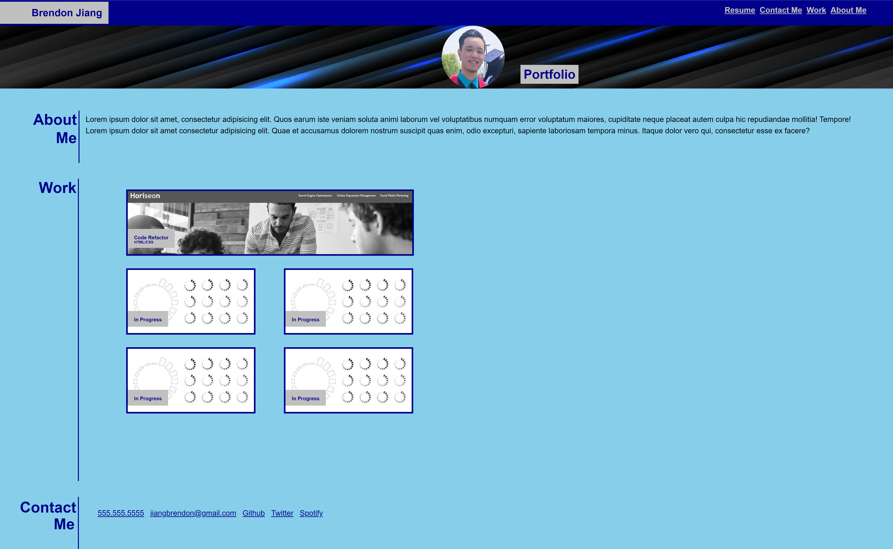

# Advanced-CSS-Profession-Portfolio
[Live Link](https://jbrendon15.github.io/Advanced-CSS-Profession-Portfolio/)

## Description

For this project, we wanted to create a professional portfolio webpage based on a mock-up. We had to use proper semantic HTML structure to design the layout of our page. We then had to use CSS to style the page. We used pseudo class to add a CSS styling technique so that the webpage has some interactivity. We learned that CSS has many styling functions to add unique presentation to a webpage.

## Usage

